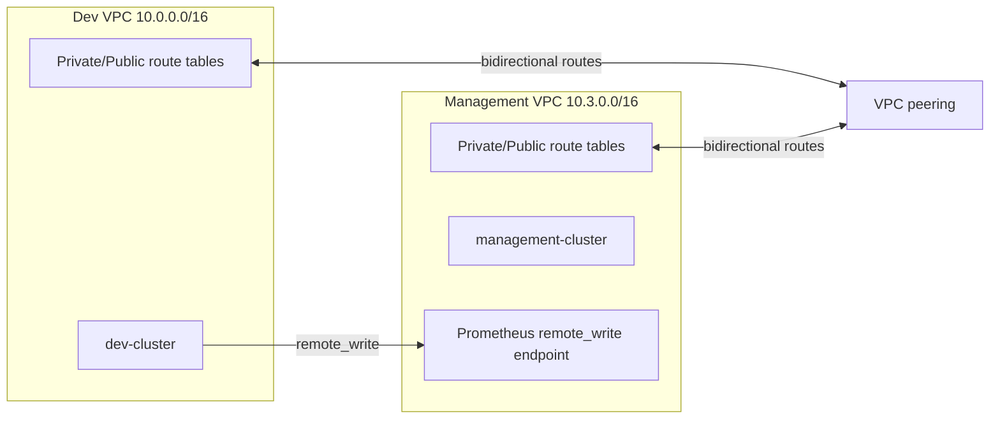

# Infrastructure-V2

## CIDR allocation

| Environment | VPC CIDR | Public subnets | Private subnets |
|---|---|---|---|
| dev | `10.0.0.0/16` | `10.0.1.0/24`, `10.0.2.0/24` | `10.0.10.0/24`, `10.0.11.0/24` |
| staging | `10.1.0.0/16` | `10.1.1.0/24` | `10.1.10.0/24` |
| prod | `10.2.0.0/16` | `10.2.1.0/24` | `10.2.10.0/24` |
| management | `10.3.0.0/16` | `10.3.1.0/24`, `10.3.2.0/24` | `10.3.10.0/24`, `10.3.11.0/24` |

The management VPC moved to `10.3.0.0/16` so it can be peered with the dev VPC without overlapping CIDRs.

## Repository layout

```text
infrastructure-v2/
├── modules/
│   ├── vpc/
│   ├── vpc-peering/
│   ├── eks/
│   ├── monitoring/
│   └── security/
├── environments/
│   ├── dev/
│   ├── staging/
│   ├── prod/
│   └── management/
├── tfvars/
└── outputs/
```

## Dev ↔ management peering architecture



## VPC peering

The `modules/vpc-peering` module creates a same-account VPC peering connection and installs bidirectional routes into every route table you pass in. The management stack reads the dev stack outputs from remote state and creates the `dev-management-peering` connection.

## Monitoring remote_write integration

The `modules/monitoring` module standardizes the values required by the Prometheus agent:

- `PROMETHEUS_REMOTE_WRITE_URL`
- `PROMETHEUS_REMOTE_WRITE_HOST`
- `PROMETHEUS_REMOTE_WRITE_PORT`
- `PROMETHEUS_REMOTE_WRITE_PATH`
- `PROMETHEUS_REMOTE_WRITE_SCHEME`
- `PROMETHEUS_REMOTE_WRITE_NAMESPACE`
- `PROMETHEUS_REMOTE_WRITE_SERVICE`

Fetch them from the management stack outputs:

```bash
cd infrastructure-v2/environments/management
terraform output -raw prometheus_agent_environment_file > /tmp/prometheus-agent.env
set -a
source /tmp/prometheus-agent.env
set +a
envsubst < ../../../monitoring/k8s-manifests/prometheus-agent-configmap.yml | kubectl apply -f -
```

If you expose Prometheus through an internal AWS load balancer, set `prometheus_remote_write_host` in `management/terraform.tfvars` to the internal DNS name so the generated URL points agents at the load balancer instead of the cluster-local service DNS name.
